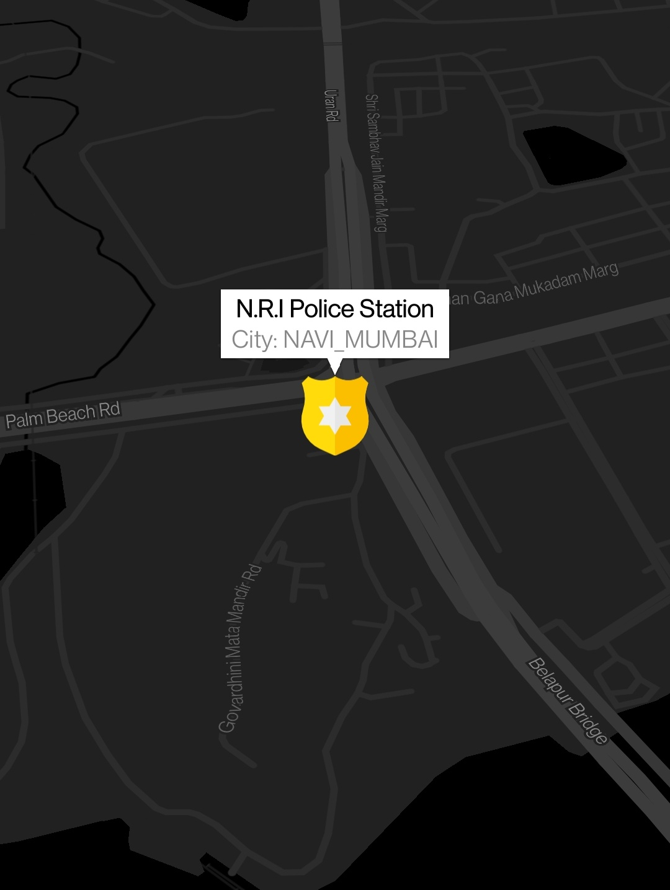
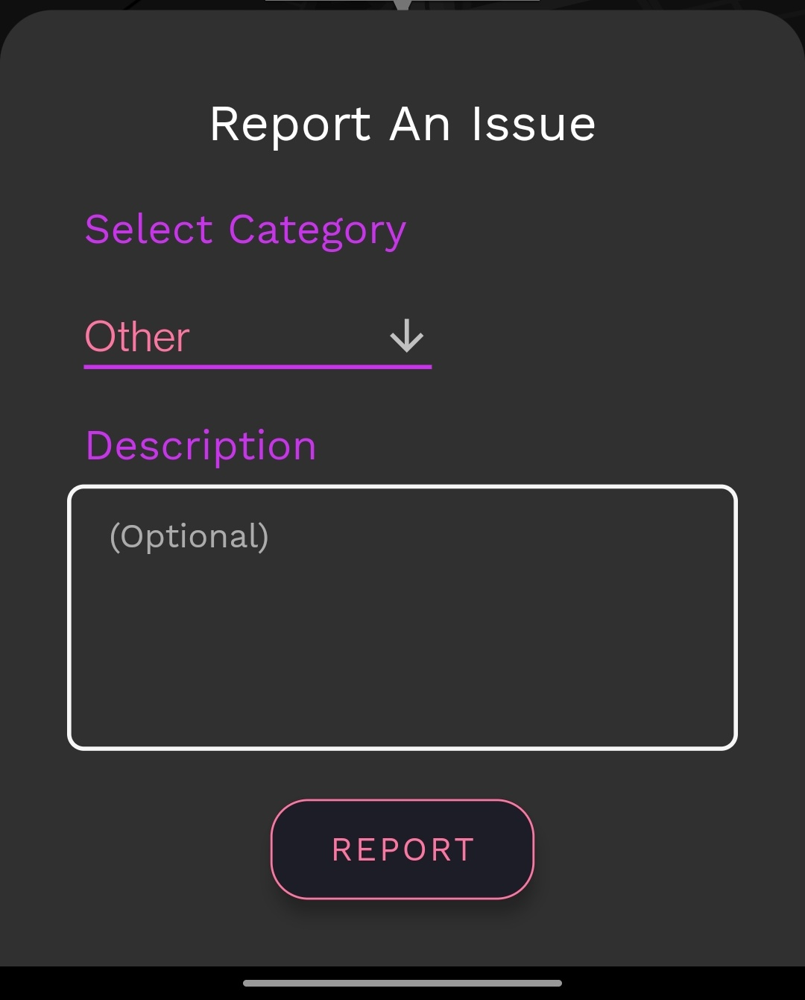

# Project Title

CrimeTracking App

## Description

SpotCrime mobile application is a handy, user-friendly and well designed
safety android application which will help you to get connected with
law enforcement officials in no time.

<h4>Signup Form</h4>
To validate the user and minimise duplicate and spam reports, registration is necessary at the start. Registration consists of filling up two forms. You have to enter an unregistered email and strong password in the first form. Personal credentials need to be filled in the second form. 
 
<h4>Login Form</h4>
After registering, you will be asked to go through the login process. This process consists of validation of your entered email address and your SpotCrime password. 
 
<h4>Home Screen</h4>
After you go through the login procedure the main screen of the application, that is,the home page is what you would be seeing. 

<h4>Your Profile</h4>
After registering, you will be asked to go through the login process. This process consists of validation of your entered email address and your SpotCrime password. 

<h4>Police Station Marker</h4>
The home page consists of a map in the background showing your exact current location as well as the police station (police badge icon) nearest to you. As soon as you tap on any of the police station icons, you’ll see the significant dataset about the respective station in the form of a pop-up. 

